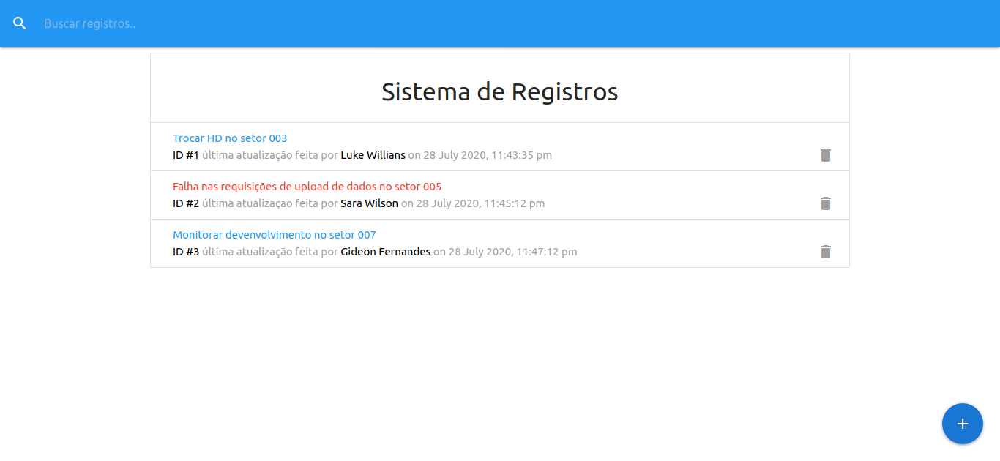

# it-logger

## Project

***EN:*** The idea of this project is to create a communication application for an IT department, in which we can add some problems with urgent tag or not, filter them by title or technician, delete them, add more logs or technicians, etc. It was developed with the aim of studying the React library with Redux during the React Front To Back course, taught by Brad Traversy.

***PT-BR:*** A idéia deste projeto é criar um aplicativo de comunicação para um departamento de TI, no qual possamos adicionar alguns problemas com tag urgente ou não, filtrá-los por título ou técnico, excluí-los, adicionar mais registros ou técnicos, etc. Foi desenvolvido com o objetivo de estudar a biblioteca do React com o Redux durante o curso React Front To Back, ministrado por Brad Traversy.

## Technologies

This project was developed with the following technologies:

- HTML
- Materialize CSS
- ReactJS
- Json-Server
***

## Preview

***

## How To Install

In the project directory, run:

### `npm install`
#### Install all dependencies.    

And then run the command in the project directory:

### `npm run dev`
#### Runs the json-server and the react app concurrently in the development mode.    

## License

This project is under the MIT license.
